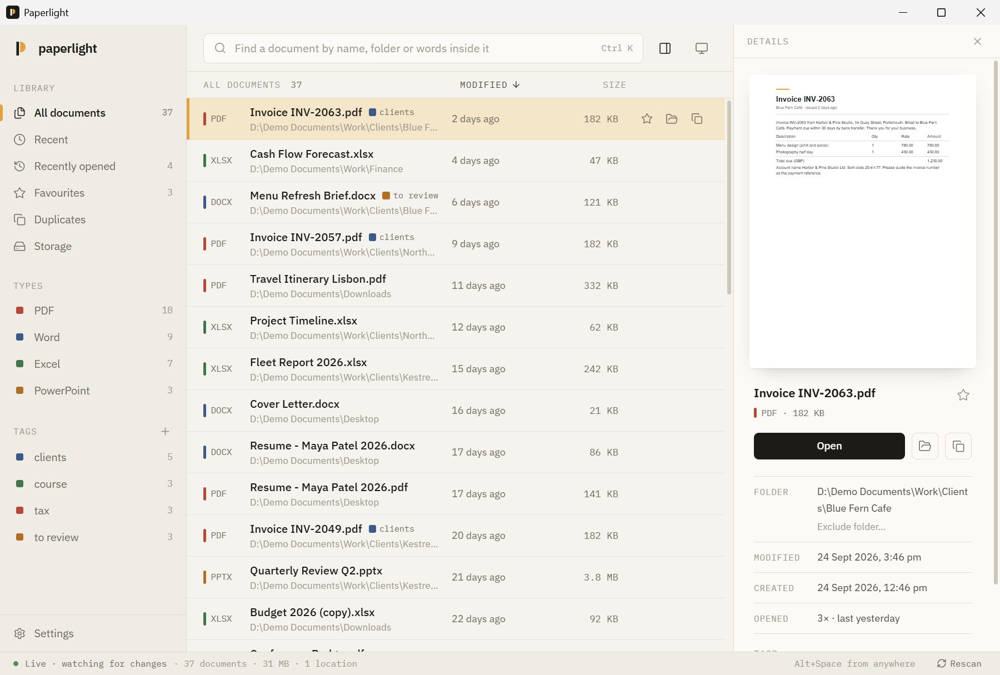
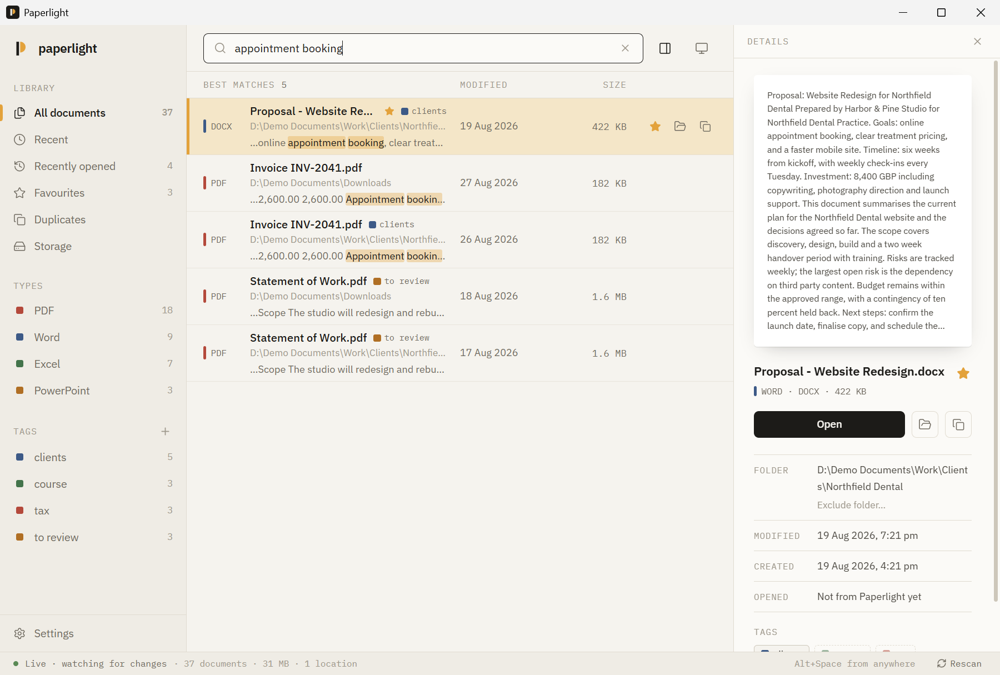
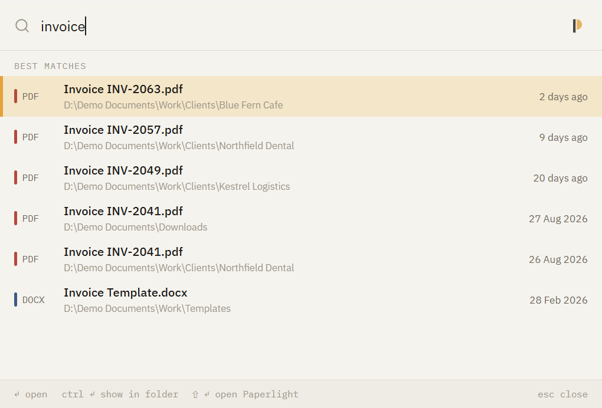
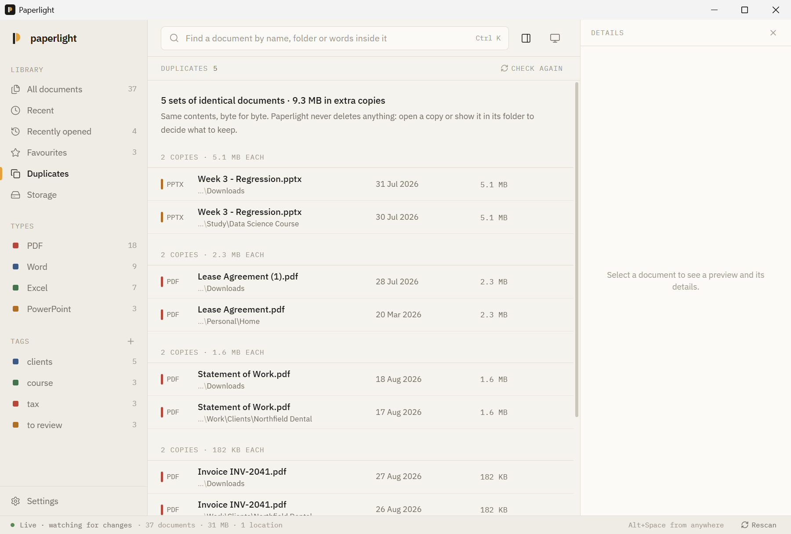
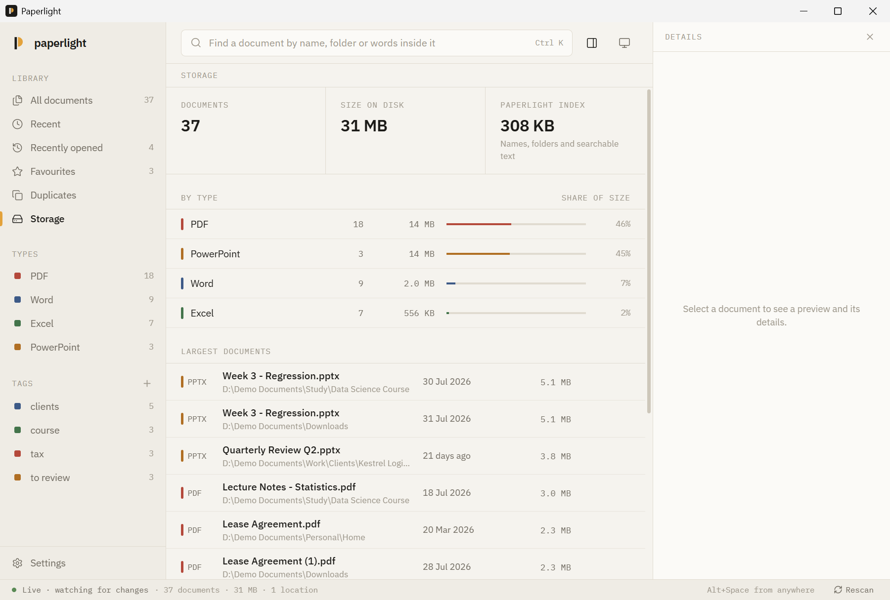
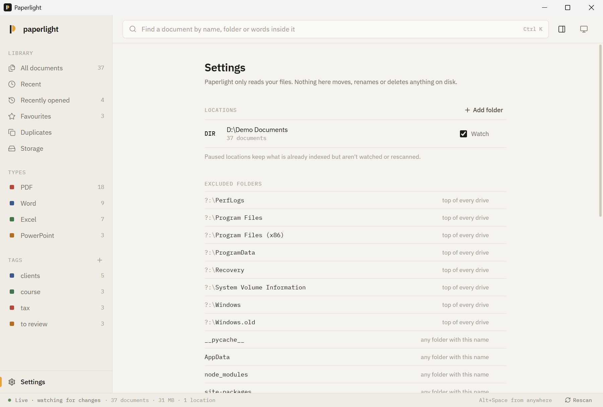
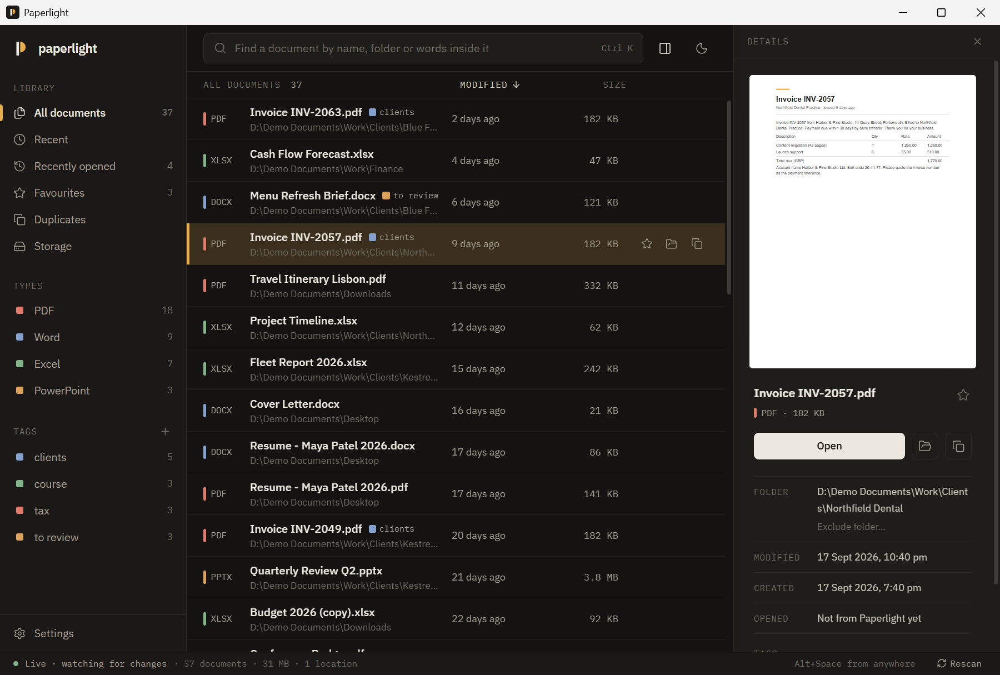

<p></p>

# Paperlight

A spotlight for every document on your PC.

Paperlight finds every PDF, Word, Excel and PowerPoint file on your Windows PC and keeps the
list current as files are added, renamed, moved or deleted. Search by name, folder or the words
inside a document, from the app or from anywhere with <kbd>Alt</kbd>+<kbd>Space</kbd>.
Your files are only read: nothing is moved, renamed, uploaded or deleted.



## Download

Get `Paperlight_1.0.0_x64-setup.exe` from the
[latest release](https://github.com/webKing021/paperlight/releases/latest) and run it
(Windows 10/11, 64-bit; installs per user, no admin rights needed). The installer is not
code-signed yet, so Windows SmartScreen may ask you to confirm: choose *More info → Run anyway*.

On first run, choose the drives or folders to index and press *Start indexing*. A laptop with a
few hundred documents is indexed in seconds; after that, a file watcher keeps up in real time.

## What it does

**Search names, folders and text.** Type part of a name, a folder, or a phrase from inside the
document. Results are ranked (names first, then folders, then text), tolerate small typos
(`reprot` finds *report*), and show the matching passage.



**Quick search from any app.** <kbd>Alt</kbd>+<kbd>Space</kbd> opens a small launcher
(falls back to <kbd>Ctrl</kbd>+<kbd>Shift</kbd>+<kbd>Space</kbd> or <kbd>Ctrl</kbd>+<kbd>Alt</kbd>+<kbd>P</kbd>
if another app owns it). <kbd>Enter</kbd> opens, <kbd>Ctrl</kbd>+<kbd>Enter</kbd> shows the file in
its folder.



**Always current.** New, changed, renamed, moved and deleted documents show up within about a
second. Renames and moves keep favourites, tags and history.

**Organise without touching files.** Favourites, tags, recently opened, recently modified and
per-type views. Tags live in Paperlight's own database, never in your files.

**Duplicates.** Finds byte-identical copies: same size first, then the first 64 KB, then a full
blake3 hash, only for files that still match. Shows where each copy lives, with Open and Show in
folder. Paperlight never deletes anything.



**Storage.** Count, size and share per type, and the largest documents.



**Settings.** Locations (add, pause, remove), excluded folders, theme, start with Windows,
rescan and reset. Any document's right-click menu also has *Exclude folder…*, which lets you drop
a whole tree (say, a tools folder) from the index in one click.



Light and dark themes follow Windows, or pick one.



### Keyboard

| Keys | Action |
|---|---|
| <kbd>Ctrl</kbd>+<kbd>K</kbd> | Focus search |
| <kbd>↑</kbd> <kbd>↓</kbd> <kbd>PgUp</kbd> <kbd>PgDn</kbd> | Move through results |
| <kbd>Enter</kbd> / <kbd>Ctrl</kbd>+<kbd>Enter</kbd> | Open / show in folder |
| <kbd>Ctrl</kbd>+<kbd>Shift</kbd>+<kbd>C</kbd> | Copy path |
| <kbd>Ctrl</kbd>+<kbd>D</kbd> | Favourite |
| <kbd>Ctrl</kbd>+<kbd>T</kbd> | Tag |
| <kbd>Ctrl</kbd>+<kbd>I</kbd> | Details panel |
| <kbd>Alt</kbd>+<kbd>Space</kbd> | Quick search from any app |

## Private and light

- **Local only.** No network access, no telemetry, no accounts. The index lives in
  `%APPDATA%\com.paperlight.app`.
- **Read-only on your documents.** Files are opened only to read their text (for search) and,
  in the Duplicates view, to compare contents.
- **Quiet in the background.** One full scan, then an event-driven watcher (no polling). A
  catch-up sync on launch runs only if the index is over 12 hours old, at background CPU and
  disk priority, and writes only what changed.
- **Small.** 4.7 MB installer. With the window closed, Paperlight sits in the tray as a ~6 MB
  process; the window's web view is destroyed, not hidden. Idle CPU is zero. The index for a
  few hundred documents, including their searchable text, takes a few MB.

Skipped by default: Windows, Program Files, ProgramData, AppData, the Recycle Bin, and
developer folders such as `node_modules`, `venv` and dot-folders. Legacy `.doc` and `.ppt`
files are listed and searchable by name, but their text isn't read.

## Build from source

Requirements: Node.js 20+, Rust (stable, MSVC), Visual Studio C++ Build Tools, WebView2.

```bash
npm install
npm run tauri dev      # run with hot reload
npm run tauri build    # installer in src-tauri/target/release/bundle/nsis
```

Checks run in CI: `npm run build` (type-check + bundle), `cargo fmt --check`,
`cargo clippy -D warnings`, `cargo test`.

Set `PAPERLIGHT_DATA_DIR` to keep a separate index (useful for demos and testing). The
screenshots above were taken this way, on a folder of made-up sample documents.

Built with [Tauri 2](https://tauri.app), Rust, SQLite (FTS5), React and Tailwind CSS.
The design and roadmap are in [PLAN.md](PLAN.md); release notes in [CHANGELOG.md](CHANGELOG.md).

## License

MIT
